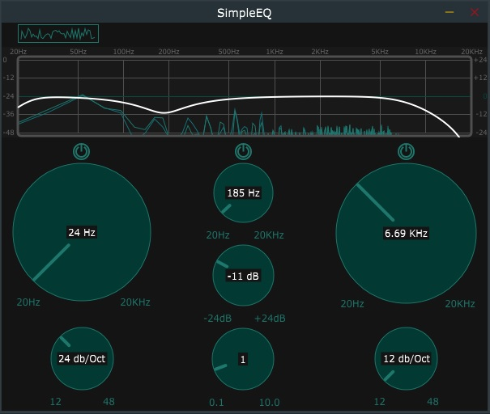

# SimpleEQ
SimpleEQ is a simple audio plugin that allow 3 band equalization. It also comes with FFT spectrum analyzer. It's made with modern C++ and the JUCE Framework.

    

## Install on your DAW
Just download the VST3 from the latest [release](https://github.com/makislayer/SimpleEQ/releases) and copy on your VST3 folder. 
Re-scan plugings on your DAW might be required.

## Compile it by yourself
You'll need an IDE compatible with [JUCE](https://juce.com/) framework. You can use Visual Studio on Windows or Xcode on MAC.
Download [projucer](https://juce.com/discover/projucer) and extract it wherever on your computer. 
Open `SimpleEQ.jucer` with the projucer and select your IDE on 'Select exporter' field. 
Once you've selected your IDE, launch the project using the IDE icon next to 'select exporter' field.
Check [juce documentation](https://docs.juce.com/master/tutorial_manage_projucer_project.html) if you need additional help launching the project from projucer.
Once you've open the project on your favourite SDK, you can compile the `SimpleEQ_VST3` solution to generate the VST3 plugin.
